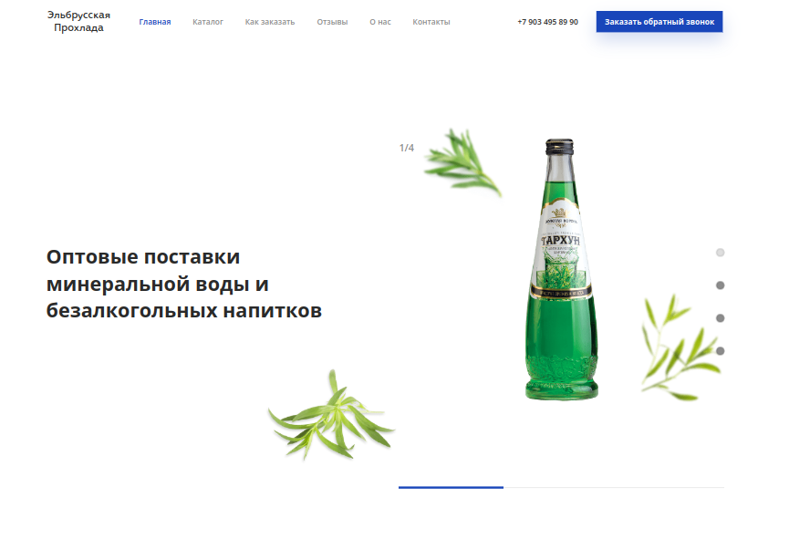
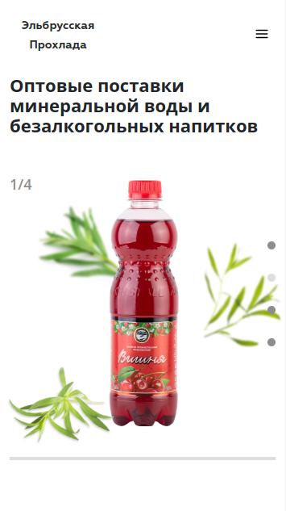
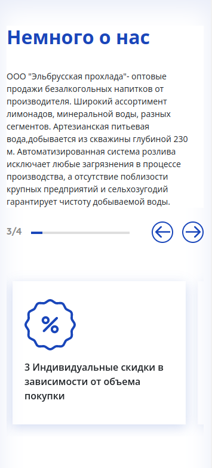

### Elbrus

---

## Первая часть задачи:

- Выполнить верстку сайта по приложенному макету <a href="https://www.figma.com/file/T5mm21MOELWw1giOdLDmIQjS/%D0%BC%D0%B8%D0%BD%D0%B2%D0%BE%D0%B4%D1%8B?node-id=1658%3A502&t=JUKDdy0YwN0VonJ3-1">figma</a>.
- Валидность и адаптивная вёрстка.
- Сделать динамику (переключение слайдов по таймеру, таймер отображается на прелоадере (полоска) под блоком).
---

## Инструменты:

       
---

 
Итоговый результат можно увидеть по данной <a href="https://brahner.github.io/elbrus">ссылке</a>

---

## Вторая часть задачи:

- На локальном сервере установил последнею версию WordPress.
- Запрограммировал наполнение контента на главной странице через поля в админке, используя плагин Advanced Custom Fields.
- Вывел элементы слайдера, карточек и группы товаров на страницу.
- Формы вывел через Contact Form 7.
- Залил на хостинг и сделал некоторую seo-оптимизацию.

---

## Результат работы:

Архив с файлами и бэкап БД в папке WP.
<a href="http://f0760251.xsph.ru">Ссылка</a> на хостинг с результатом работы.